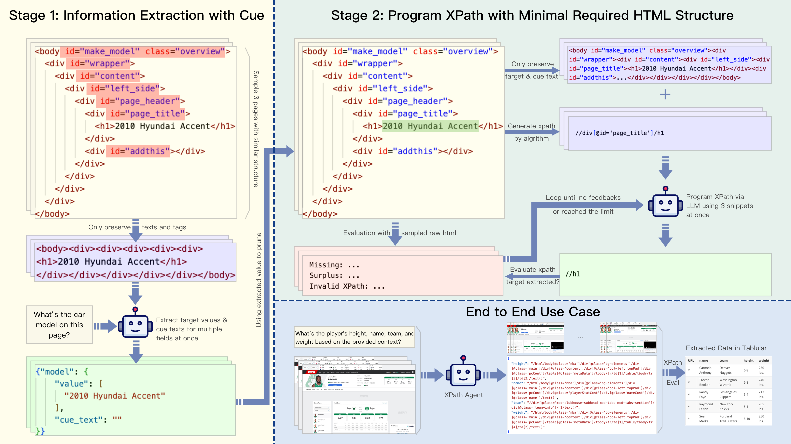

# XPath Agent

XPath Agent is an advanced language model-based crawler designed to efficiently extract information from massive html files.



## How to Reproduce

To reproduce the results presented in the associated paper, follow the steps below using the provided command-line interface script.

### Prerequisites

Ensure you have the necessary dependencies installed.

```bash
# create a new python environment via conda
conda create -n feilian python=3.10
# install dependencies via pip
python -m pip install -r requirements.txt
```

Configure environment variables. For example, if you are using OpenAI API, ensure following environment variables are setting correctly:

```bash
OPENAI_API_KEY=sk-xxx
```

Download SWDE & SWDE_Extended to data folder, and unzip.

- SWDE: https://academictorrents.com/details/411576c7e80787e4b40452360f5f24acba9b5159
- SWDE_Extended: https://github.com/cdlockard/expanded_swde

### Running the Experiment

Use the following command to run the experiment:

```bash
python scripts/experiment_cli.py --dataset <DATASET> --ie_model <IE_MODEL> --program_model <PROGRAM_MODEL> --name <EXPERIMENT_NAME>
```

### Command-Line Arguments

- `--dataset`: Specifies the dataset to use. Options are `SWDE` or `SWDE_Extended`.
- `--data_dir`: The directory where the dataset is stored. Default is `data/swde`.
- `--ie_model`: The information extraction model to be used.
- `--program_model`: The program model to be used.
- `--ablation`: Optional. Specifies the ablation study option. Choices are
- `--eval_sample_size`: The number of samples to evaluate. Default is `32`.
- `--output`: The directory where the results will be saved. Default is `.tmp`.
- `--env`: The environment file to load variables from. Default is `.env`.
- `--seed`: The random seed for reproducibility. Default is `0`.
- `name`: A unique identifier for the experiment.
